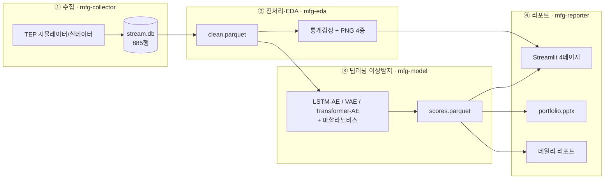
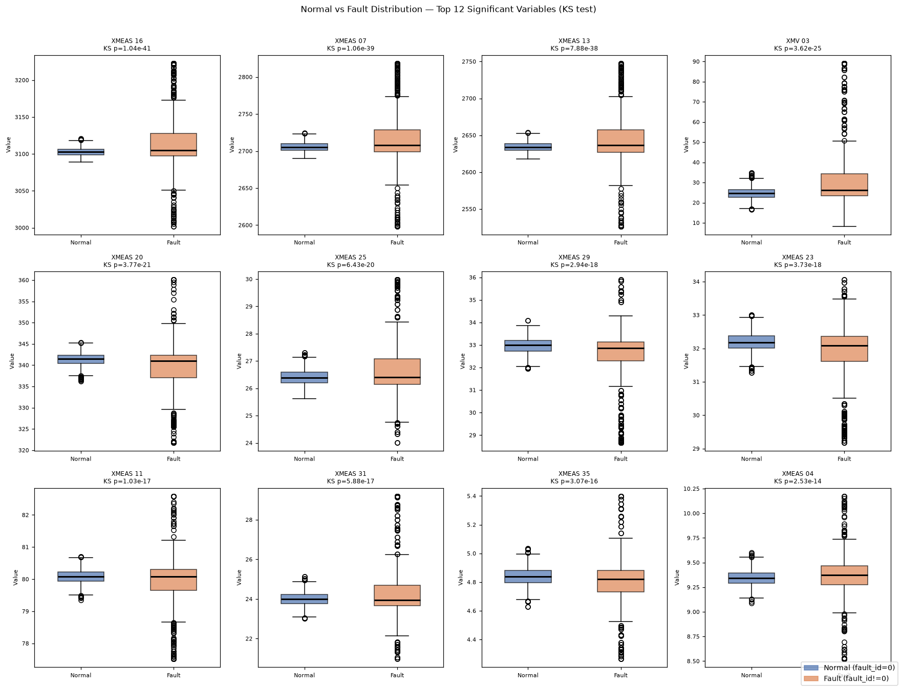
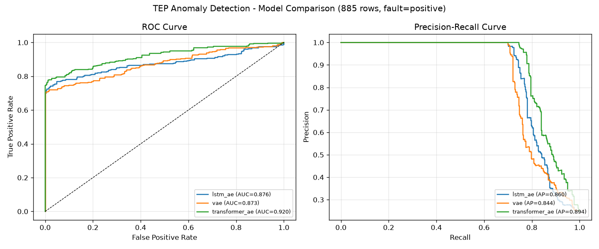
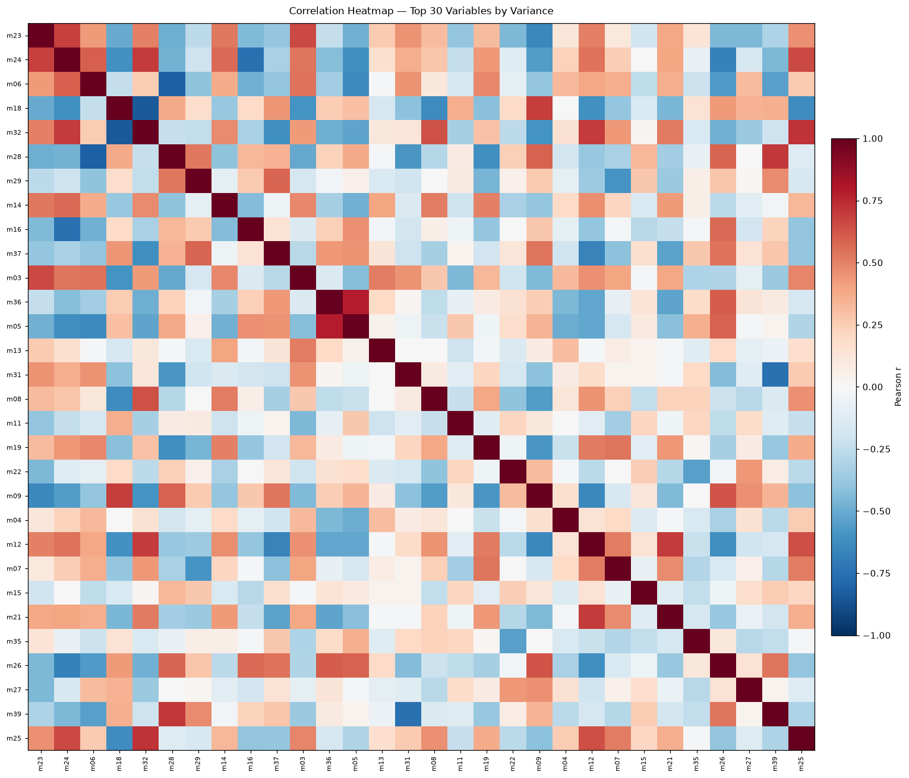
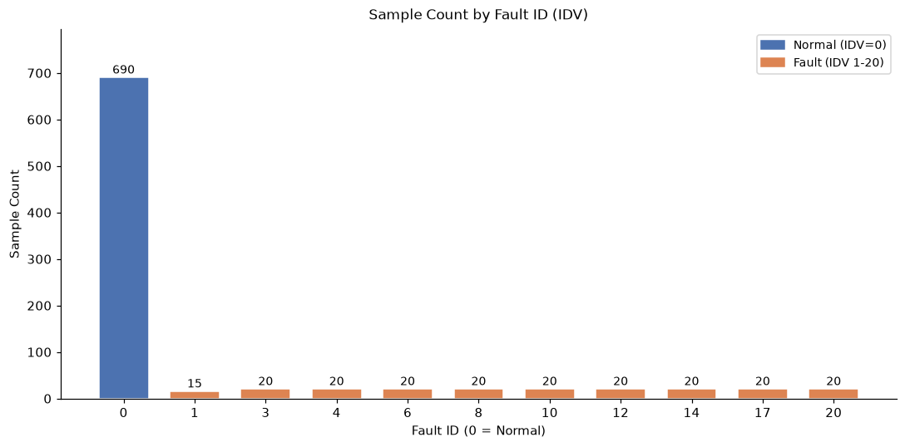

# 🏭 제조 공정 이상탐지 자동화 워크플로우

[](https://github.com/robinho0329/mfg-anomaly-workflow/actions/workflows/ci.yml)


화학공정(Tennessee Eastman Process) 다변량 시계열에 대한 **딥러닝 이상탐지**를
**수집 → 전처리/EDA/통계 → 모델링 → 대시보드/PPT** 전 과정으로 자동화한 포트폴리오 프로젝트.

> 🔗 **라이브 데모**: `<배포된 Streamlit URL을 여기에 붙여넣기>`

## 핵심 메시지

> 모델 하나가 아니라 **데이터가 흘러 들어와 인사이트와 리포트로 나오는 파이프라인 전체**를 자동화했다.
> 각 단계는 전담 에이전트가 소유·유지보수한다.

## 아키텍처



| 단계 | 모듈 | 담당 에이전트 | 산출물 |
|------|------|--------------|--------|
| ① 수집 | `src/collect/` | `mfg-collector` | `stream.db` (TEP 52변수) |
| ② 전처리·EDA | `src/pipeline/` | `mfg-eda` | `clean.parquet`, 통계·PNG |
| ③ 딥러닝 이상탐지 | `src/models/` | `mfg-model` | `scores.parquet`, 모델카드 |
| ④ 대시보드·PPT | `src/report/` | `mfg-reporter` | Streamlit 4페이지, PPT, 데일리 |

## 모델 성능 (885행 · 정상 690 / 결함 195 · IDV 10종)

준지도 이상탐지 — 정상 운전만으로 AE를 학습하고, **재구성오차 벡터의 마할라노비스 거리**로 이상을 판정한다.

| 모델 | Precision | Recall | F1 | ROC-AUC | PR-AUC | 오탐(FP) |
|------|-----------|--------|----|---------|--------|---------|
| **VAE** (기본) | **0.956** | 0.662 | **0.782** | **0.826** | **0.802** | 0.9% |
| LSTM-AE | 0.863 | 0.615 | 0.719 | 0.819 | 0.778 | 2.8% |
| Transformer-AE | 0.642 | 0.615 | 0.628 | 0.816 | 0.742 | 10% |

> **정직한 한계**: IDV 1·4·8은 재구성오차가 정상과 구별되지 않아 AE 계열 원리상 미탐된다(`src/models/MODEL_CARD.md`에 명시). 단일 재구성오차 임계값이 데이터 확대 시 붕괴해 마할라노비스 거리로 전환한 것도 같은 문서에 기록.

## 결과 샘플

| 정상 vs 결함 분포 | ROC / PR 커브 |
|---|---|
|  |  |

| 변수 상관 히트맵 | 결함 IDV별 샘플 수 |
|---|---|
|  |  |

## 빠른 시작

```bash
# 로컬 전체 워크플로우(딥러닝 학습 포함) — TensorFlow 등 전체 의존성
pip install -r requirements-train.txt

# 전체 워크플로우 실행 (수집 → 전처리/EDA → 탐지 → PPT)
python run_workflow.py --collect-batches 12 --ppt

# 대시보드 (4페이지: 수집현황·EDA통계·이상탐지·모델비교)
streamlit run src/report/dashboard/app.py

# 데일리 현황 리포트
python -m src.report.daily_report

# 테스트
pytest tests/
```

> `requirements.txt` = **Streamlit Cloud 배포용 경량**(TF 미포함) · `requirements-train.txt` = **로컬 학습용 전체**.

## Streamlit Cloud 배포

대시보드는 사전계산 산출물(`data/models/scores.parquet` 등)만 읽으므로 **TensorFlow 없이 경량 배포**된다.

1. share.streamlit.io 접속 → GitHub repo 선택
2. **Main file path**: `src/report/dashboard/app.py`
3. Deploy (루트 `requirements.txt` 가 자동 적용 — 경량)

산출물 갱신 시: 워크플로우 재실행 후 `git add -f data/models/scores.parquet` 로 다시 커밋(데이터는 기본 .gitignore 대상).

## 데이터

- **시뮬레이터 스트림**(기본): TEP 구조(52변수, 정상+20결함)를 재현해 '살아있는 수집' 데모.
- **실제 TEP 데이터**: Rieth et al. 2017(Harvard Dataverse)을 `data/raw/`에 드롭하면 `tep_loader`가 우선 적재.

## 기술 스택

pandas · numpy · scipy · scikit-learn · TensorFlow(LSTM-AE/VAE/Transformer-AE) · Streamlit · python-pptx
